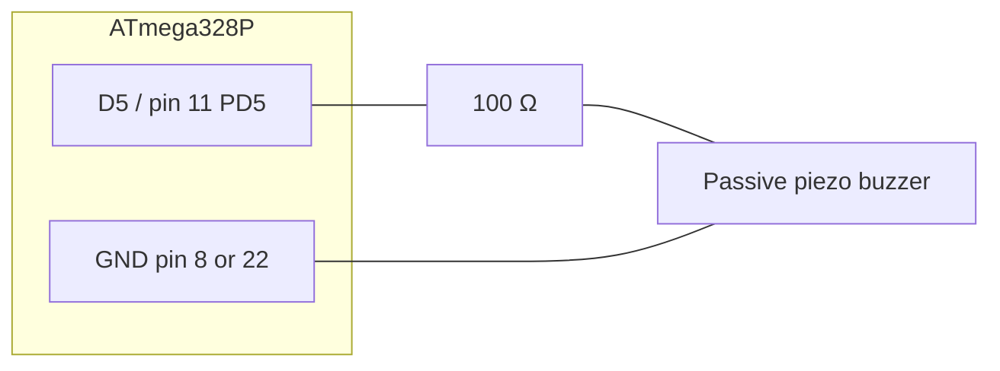

# Passive piezo buzzer — wiring (Milestone 4a)

Matches `milestone_4a.ino`: **`BUZZER_PIN = 5`** → **Arduino D5** → **ATmega328P DIP pin 11 (PD5)**.

## Schematic (ASCII)

```
                    ATmega328P (standalone breadboard)
                    -----------------------------------
                    GND (pins 8, 22) ----+----o  buzzer (-)
                                         |
                    D5 / pin 11 (PD5) ---+----[ 100 Ω ]----o  buzzer (+)

    Use 100 Ω–220 Ω in series to limit current. Polarity on a 2-pin passive
    buzzer usually does not matter.
```

## Connection table

| Signal        | Arduino name | ATmega328P DIP pin | Buzzer / resistor        |
|---------------|--------------|--------------------|--------------------------|
| Buzzer drive  | D5           | 11 (PD5)           | 100 Ω → buzzer (+)       |
| Ground        | GND          | 8 or 22            | Buzzer (−)               |

## Notes

- **Software:** `tone(BUZZER_PIN, 2000)` uses **Timer2**; servo PWM stays on **Timer1** (D9).
- **Power:** Buzzer draws current only while beeping; keep **common GND** with the rest of the locker circuit.

## Mermaid (for docs / slides)


